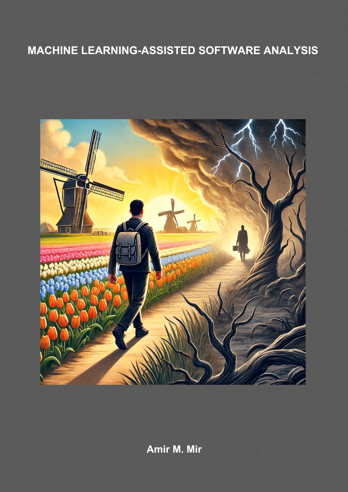
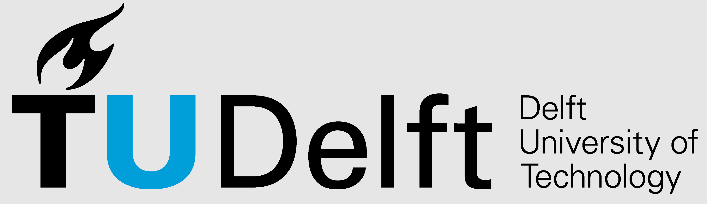
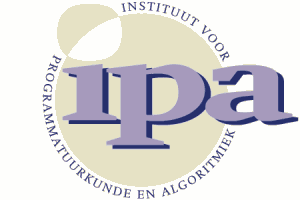

# Machine Learning-assisted Software Analysis
This repository contains my PhD thesis for receiving the degree of Doctor of Philosophy at Delft University of Technology. I defended my PhD thesis on Thursday, February 6th, 2025, at 3 PM in Aula, TU Delft.

  <a href="./PhD_Thesis_Mir.pdf" style="display: inline-flex; align-items: center; text-decoration: none; margin-right: 1.5em;">
    
    <strong>PDF File</strong>
  </a>

  <a href="./src/" style="display: inline-flex; align-items: center; text-decoration: none;">
    
    <strong>Source Files</strong>
  </a>

The thesis is also stored on the TU Delft library website [here](https://repository.tudelft.nl/record/uuid:2d59214f-2d2f-48f0-ae10-003fd3b83e61).

- [Summary](#summary)
- [Cover](#cover)
- [Doctoral Commitee](#doctoral-commitee)
- [Funding](#funding)
- [License](#license)
- [ISBN](#isbn)

# Summary

Software engineering, fundamental to modern technological advancement, profoundly
influences various aspects of society by enhancing efficiency, accessibility, and security.
This discipline involves systematically applying engineering principles to software systems’
design, development, testing, and maintenance. Innovations in software engineering
have revolutionized industries such as communication, finance, healthcare, and education,
democratizing access to information and connecting global communities. As software
systems become increasingly complex, the need for efficient, secure, and reliable software
analysis tools becomes paramount.

The thesis focuses on improving the actionability and scalability of software analysis
by integrating machine learning (ML) techniques. Traditional static analysis tools often
struggle with large codebases, leading to high false positive rates and high computational
costs. Machine learning, particularly deep learning architectures like Transformers, offers a
promising solution by capturing long-range dependencies in code and learning hierarchical
representations. This capability enables ML models to automate tasks such as bug detection,
source code summarization, and program repair, providing developers with actionable
insights and improving overall productivity and code quality.

A significant contribution of this thesis is the development of ML-based techniques for
type inference in Python and call graph pruning. An ML-based type inference approach,
namely Type4Py, was proposed, which accurately predicts type annotations for Python
code, enhancing code quality and reducing runtime errors. ML models with conservative
pruning strategies were proposed for call graph pruning, which learns from dynamic traces
obtained by executing programs to identify and eliminate false edges, thereby minimizing
false positives and improving precision. Additionally, the thesis explores the application of
call graphs in vulnerability analysis, demonstrating that granular assessments provide more
accurate and actionable insights than more straightforward, dependency-level analyses.

In summary, this thesis advances the field of software analysis by harnessing machine
learning to address two important issues related to the actionability and scalability of software
analysis tools. The proposed ML-driven tools and techniques enhance the precision
and reliability of software analysis and support developers in maintaining robust, secure,
and maintainable software systems. These contributions pave the way for future research
in applying ML techniques to various aspects of software engineering, promising further
improvements in software development practices.

**Keywords:** Machine Learning, Software Analysis, Software Engineering

# Cover

The cover is generated by Open AI's DALL·E 3. The prompt used for generating the cover is private.

# Doctoral Commitee
Supervisors:
- Prof. Arie van Deursen
- Dr. Sebastian Proksch
- Dr. Georgios Gousios

Independent members:
- Prof. Fernando Kuipers
- Prof. Michael Pradel 
- Prof. Prem Devanbu
- Dr. Baishakhi Ray
- Prof. Andy Zaidman

# Funding 
This thesis was funded by [the FASTEN project](https://swforum.eu/project-hub/fine-grained-analysis-software-ecosystems-networks), a European Union’s Horizon 2020 research and innovation program under grant agreement number 825328.

# License
This PhD thesis is licensed under the terms of Attribution-NonCommercial-ShareAlike 4.0 International ([CC BY-NC-SA 4.0](https://creativecommons.org/licenses/by-nc-sa/4.0/)).

# ISBN
978-94-6518-015-1

---

